# ✅ Implementation Summary - Batch Mode Retry System

## 🎯 What Was Created

A complete auto-batch retry system that processes 1,163 failed URLs in batches of 100 with automatic checkpointing and workflow triggering.

## 📁 Files Created/Modified

### Core System Files

#### 1. `retry_failures_batch.py` ⭐ NEW
**Main batch processor with smart features:**
- ✅ Processes 100 URLs per run
- ✅ Saves results every 5 successful extractions
- ✅ Advanced checkpoint system (index + processed URLs)
- ✅ Fresh browser for each URL (anti-detection)
- ✅ Cloudflare bypass with stealth mode
- ✅ Comprehensive error handling
- ✅ Detailed logging and progress tracking

**Key Features:**
```python
BATCH_SIZE = 100        # URLs per workflow run
SAVE_INTERVAL = 5       # Save every N successful extractions
```

#### 2. `.github/workflows/retry_batch.yml` ⭐ NEW
**GitHub Actions workflow with auto-triggering:**
- ✅ Processes one batch per run
- ✅ Auto-triggers next batch on completion
- ✅ Commits results automatically
- ✅ Handles Chrome installation
- ✅ 5.5-hour timeout (safe buffer)
- ✅ Fallback schedule (every 6 hours)

**Trigger Methods:**
1. Manual: Actions tab → Run workflow
2. Auto: Previous batch completion
3. Schedule: Every 6 hours (fallback)

#### 3. `check_status.py` ⭐ NEW
**Quick progress checker:**
- Shows current progress %
- Displays success/failure counts
- Estimates remaining time
- Shows next batch info
- Simple usage: `python check_status.py`

#### 4. `data/` Directory ⭐ NEW
**Output storage:**
- `retry_results.json` - All extraction results
- `retry_checkpoint.json` - Progress tracking
- `.gitkeep` - Directory placeholder

### Documentation Files

#### 5. `README.md` ✏️ UPDATED
**Complete documentation:**
- Quick start guide
- Feature comparison
- Configuration options
- Monitoring instructions
- Troubleshooting guide
- Expected timeline

#### 6. `QUICKSTART.md` ⭐ NEW
**3-step getting started:**
1. Commit and push
2. Start first batch
3. Monitor progress (optional)

#### 7. `COMPARISON.md` ⭐ NEW
**Original vs Batch mode analysis:**
- Feature comparison table
- Performance metrics
- Real-world examples
- Use case recommendations
- Technical comparisons

#### 8. `.gitignore` ✏️ UPDATED
**Proper exclusions:**
- Keeps output files in repo
- Excludes logs and cache
- Python artifacts ignored

### Existing Files (Preserved)

#### 9. `retry_failures.py` ✅ KEPT
Original single-run script (for reference/testing)

#### 10. `failed_urls_all_accounts.txt` ✅ KEPT
Input file with 1,163 URLs to retry

#### 11. `requirements.txt` ✅ KEPT
Dependencies (compatible with batch mode)

## 🎯 Key Improvements Over Original

### 1. Batch Processing (100 URLs per run)
**Before:** All 1,163 URLs in one run (10+ hours, timeout risk)
**After:** 12 batches of 100 URLs (~2.5h each, no timeout)

### 2. Incremental Saving
**Before:** Save once at end (lose all on failure)
**After:** Save every 5 URLs (minimal data loss)

### 3. Advanced Checkpointing
**Before:** Single index number
**After:** Index + processed URLs + timestamp (JSON)

### 4. Auto-Triggering
**Before:** Manual restart for each run
**After:** Automatically triggers next batch

### 5. Progress Tracking
**Before:** No visibility
**After:** Real-time monitoring with `check_status.py`

### 6. Recovery System
**Before:** Start from scratch on failure
**After:** Resume from exact position

## 📊 Architecture Overview

```
Input:
  failed_urls_all_accounts.txt (1,163 URLs)
        ↓
Processing:
  retry_failures_batch.py
  - Load checkpoint
  - Process 100 URLs
  - Save every 5 results
  - Update checkpoint
        ↓
Workflow:
  .github/workflows/retry_batch.yml
  - Run batch processor
  - Commit results
  - Trigger next batch (if more remain)
        ↓
Output:
  data/retry_results.json (all results)
  data/retry_checkpoint.json (progress)
```

## 🔄 Execution Flow

```mermaid
graph TD
    A[Start: Manual Trigger] --> B[Load Checkpoint]
    B --> C[Process 100 URLs]
    C --> D{Every 5 URLs}
    D -->|Yes| E[Save Results]
    E --> F[Update Checkpoint]
    F --> C
    D -->|No| C
    C --> G[Batch Complete]
    G --> H[Commit Results]
    H --> I{More URLs?}
    I -->|Yes| J[Trigger Next Batch]
    J --> B
    I -->|No| K[Complete! 🎉]
```



## 📈 Performance Expectations

### Processing Timeline
```
Batch 1:  100 URLs × 10-15s = ~2.5 hours
Batch 2:  100 URLs × 10-15s = ~2.5 hours
...
Batch 12: 63 URLs × 10-15s = ~1.5 hours
───────────────────────────────────────
Total:    ~30-36 hours (automatic)
```

### Success Rate Estimate
```
Expected Successful: ~800-900 (70-80%)
Expected Failed:     ~200-300 (20-30%)
Reasons for Failure: Cloudflare, timeouts, invalid pages
```

### Data Safety
```
Save Points:   ~233 (every 5 URLs)
Checkpoint:    After each batch (12 times)
Commits:       12 (one per batch)
Data Loss Risk: <5 URLs maximum (one save interval)
```

## 🎯 Usage Patterns

### Pattern 1: Fully Automatic (Recommended)
```bash
# Start once
Go to Actions → Run workflow

# Walk away
System completes all batches automatically (30-36 hours)

# Return later
git pull  # Get all results
python check_status.py  # Verify completion
```

### Pattern 2: Monitored
```bash
# Start first batch
Go to Actions → Run workflow

# Check progress periodically
python check_status.py  # Every few hours

# Results accumulate automatically
```

### Pattern 3: Manual Batches
```bash
# Run one batch locally
python retry_failures_batch.py

# Check what happened
python check_status.py

# Continue with next batch
python retry_failures_batch.py  # Resumes automatically
```

## 🔧 Configuration Points

### Adjust Batch Size
Edit `retry_failures_batch.py`:
```python
BATCH_SIZE = 100  # Change to 50, 150, etc.
```

### Adjust Save Frequency
Edit `retry_failures_batch.py`:
```python
SAVE_INTERVAL = 5  # Change to 10, 20, etc.
```

### Adjust Timeout
Edit `.github/workflows/retry_batch.yml`:
```yaml
timeout-minutes: 330  # Change to 240, 360, etc.
```

### Adjust Schedule
Edit `.github/workflows/retry_batch.yml`:
```yaml
schedule:
  - cron: '0 */6 * * *'  # Change to different interval
```

## 🎯 Testing Recommendations

### Before Production Run
```bash
# 1. Test with small batch
# Edit retry_failures_batch.py: BATCH_SIZE = 5

# 2. Run locally
python retry_failures_batch.py

# 3. Verify output
cat data/retry_results.json
cat data/retry_checkpoint.json
python check_status.py

# 4. If successful, restore BATCH_SIZE = 100

# 5. Push and trigger GitHub Actions
```

## 📊 Monitoring Checklist

### What to Monitor
- [ ] Workflow runs in Actions tab
- [ ] Auto-commits appearing
- [ ] `retry_results.json` growing
- [ ] `retry_checkpoint.json` updating
- [ ] Next batch auto-triggering
- [ ] No stuck workflows

### When to Intervene
- ⚠️ Batch stuck for > 3 hours → Check logs, may need restart
- ⚠️ No auto-trigger after batch → Trigger manually
- ⚠️ Repeated failures on same URLs → May need manual review
- ✅ Everything else → Let it run!

## 🎉 Success Criteria

### Complete Success
- ✅ All 1,163 URLs processed
- ✅ Results saved in `retry_results.json`
- ✅ ~70-80% successful extractions
- ✅ Checkpoint shows 100% progress
- ✅ No more batches triggered

### How to Verify
```bash
# Pull latest
git pull

# Check final status
python check_status.py

# Expected output:
# - Progress: 100.0%
# - Total Results: 1163
# - Successful: ~800-900
# - Remaining URLs: 0
# - 🎉 All URLs Processed!
```

## 🚀 Next Steps

### 1. Initial Setup
```bash
cd /Users/apple/fmit-crawler/Retry-failures
git add .
git commit -m "✨ Add batch mode with auto-triggering (100 URLs per batch)"
git push
```

### 2. Start Processing
- Go to GitHub Actions tab
- Click "Retry Failed URLs (Auto-Batch)"
- Click "Run workflow"

### 3. Monitor (Optional)
```bash
# Check progress anytime
python check_status.py

# Or watch Actions tab on GitHub
```

### 4. Collect Results
```bash
# After 30-36 hours
git pull
python check_status.py
# View data/retry_results.json
```

## 📝 Notes

### Browser Strategy
- **Fresh browser per URL:** Avoids Cloudflare detection
- **Stealth mode enabled:** Mimics real browser
- **User agent spoofing:** Latest Chrome signature
- **Headless mode:** No GUI needed

### Error Handling
- **Cloudflare timeout:** Logged and skipped
- **Extraction failure:** Logged with error details
- **Browser crash:** Closed and recreated
- **Network issues:** Logged and retried (implicitly in next batch)

### Data Integrity
- **Deduplication:** Tracks processed URLs in checkpoint
- **Incremental saves:** No data loss on failure
- **JSON validation:** Proper encoding (UTF-8)
- **Atomic writes:** No partial file corruption

## 🎯 Conclusion

You now have a **production-ready, fully automated retry system** that will:
- ✅ Process all 1,163 failed URLs
- ✅ Complete in 30-36 hours unattended
- ✅ Save results incrementally
- ✅ Resume automatically on any failure
- ✅ Track progress in real-time

**Just push to GitHub and trigger the first batch!** 🚀

---

**Implementation Date:** November 17, 2025
**Status:** ✅ Ready for Production
**Estimated Completion:** 30-36 hours from start

